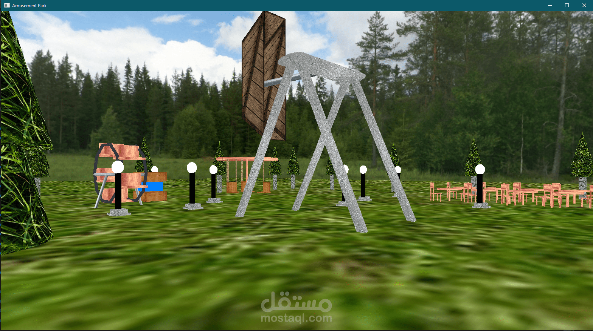

# Simple 3D Amusement Park App

## About

This repository contains a simple 3D Amusement Park application created with C++ and OpenGL using the GLUT library. It features background scenery and sound to enhance the environment.

## How to Run

1. Clone this repository to your computer.

2. Build the project using a C++ compiler.

3. Run the executable file (`source.cpp`).

## Controls

- Use W, A, S, D keys to move around.
- Use the Q and E keys to move up and down.

## Usage

Launch the app to explore the 3D amusement park, interact with rides, and enjoy the atmosphere with background scenery and sound.

## Contributing

Feel free to contribute by forking this repository, making your changes, and creating a pull request.

## License

This project is under the MIT License.

## Contact

If you have questions or feedback, you can contact me through my GitHub profile or email.

- GitHub: [yazantahan](https://github.com/yazantahan)
- Email: thn.soperma@gmail.com

Enjoy your time in the Simple 3D Amusement Park App!
